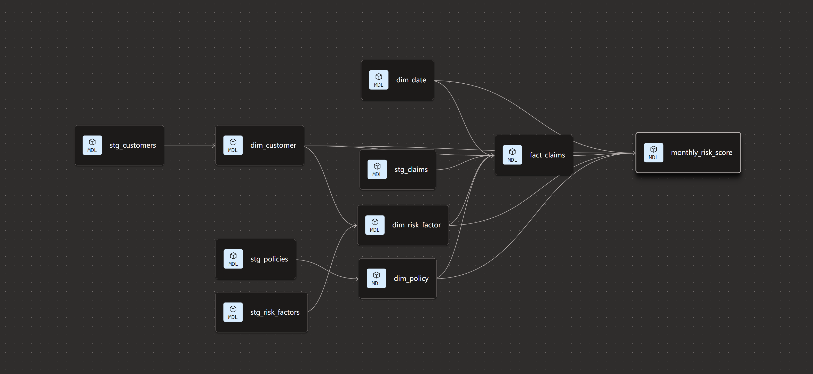

# Insurance Risk Data Warehouse (dbt + Snowflake)

## 项目概述
使用 dbt + Snowflake 构建的保险风险数据仓库，采用 Kimball 维度建模（星型 + 雪花型），包含：
- 合成精算数据（10万条）：客户、保单、理赔、风险因子
- 层次：raw → staging → marts (dim + fact + analytics)
- 核心事实表：fact_claims
- 维度：dim_customer, dim_policy, dim_date, dim_risk_factor (雪花型)
- 分析层：Monthly Risk Score, Claims by Product, Customer LTV

## 技术栈
- Snowflake (Enterprise Trial via Partner Connect)
- dbt Cloud (Developer 免费计划)
- 维度建模：Kimball 方法
- 测试：not_null, unique, relationships, accepted_values
- 文档：dbt docs + lineage 图

## 项目结构
models/
├── sources.yml
├── staging/          # 轻量清洗视图
├── marts/
│   ├── dim/          # 维度表
│   ├── fact/         # 事实表
│   └── analytics/    # 业务分析层
└── schema.yml        # 测试定义
text## 如何运行
1. dbt run --select staging.*
2. dbt run --select dim_* fact_claims
3. dbt run --select analytics.*
4. dbt test
5. dbt docs generate && dbt docs serve

## 业务价值
- Monthly_Risk_Score：监控产品风险趋势
- Claims_By_Product：计算损失率、理赔频率
- Customer_LTV：粗估客户净贡献与终身价值

## Lineage 示例

## 联系
Jingxu Lan | Waterloo, ON | Data Engineer Candidate
