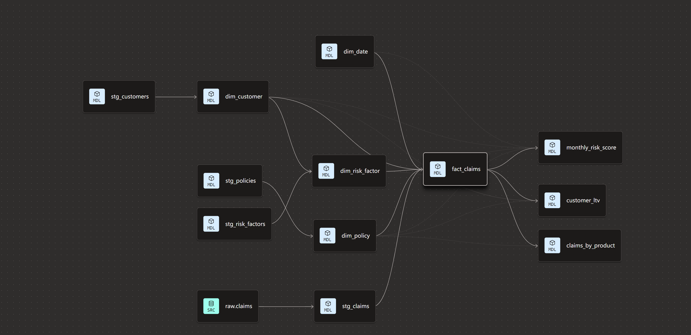
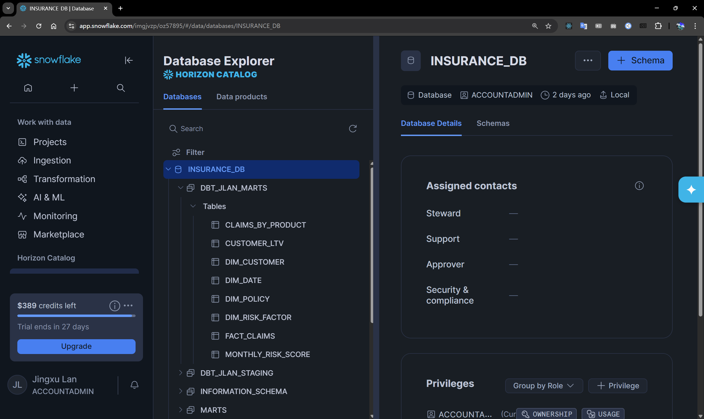
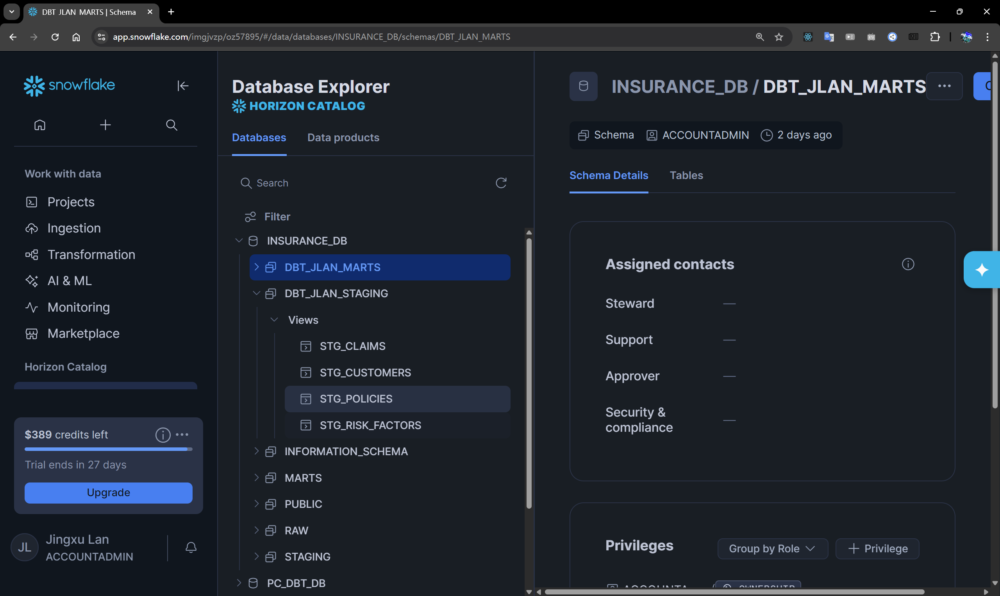
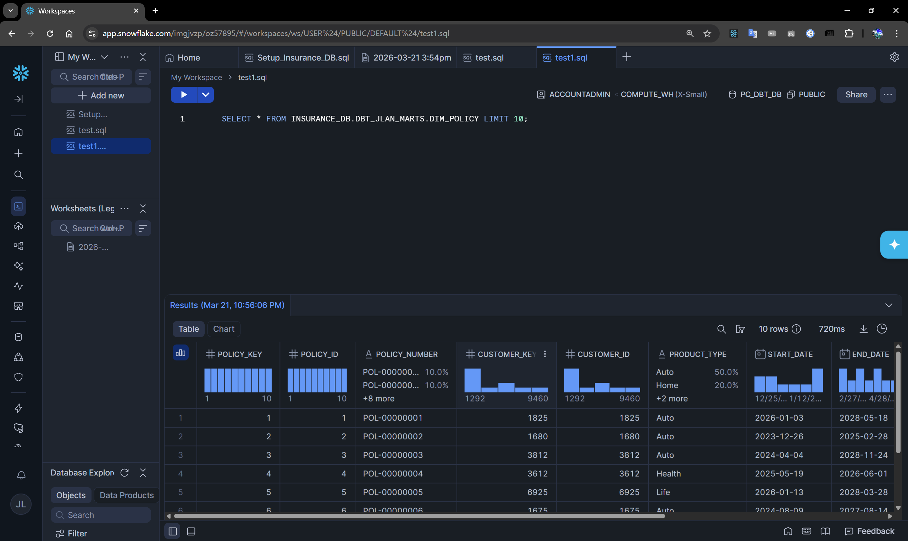

# 🏛️ Insurance Risk Data Warehouse (dbt + Snowflake)

## 📌 Project Overview
This project is an end-to-end **Insurance Risk Data Warehouse** built with **dbt** and **Snowflake**. Designed using **Kimball's dimensional modeling** methodology (incorporating both Star and Snowflake schemas), it transforms raw data into actionable business intelligence.

The pipeline processes over 100,000 records of synthetic actuarial data—encompassing customers, policies, claims, and risk factors—and flows through a structured three-tier architecture: `raw` ➔ `staging` ➔ `marts` (dim + fact + analytics).

### 🏗️ Data Architecture
- **Fact Table:** `fact_claims` (Core transactional data)
- **Dimension Tables:** `dim_customer`, `dim_policy`, `dim_date`, `dim_risk_factor` (Snowflake schema integration)
- **Analytics Layer:** Pre-aggregated views tailored for actuarial and business reporting.

## 🛠️ Tech Stack
- **Data Warehouse:** Snowflake (Enterprise Trial via Partner Connect)
- **Transformation & Modeling:** dbt Core & dbt Cloud (Developer Free Plan)
- **Data Modeling:** Kimball Methodology
- **Data Quality & Testing:** dbt native tests (`not_null`, `unique`, `relationships`, `accepted_values`)
- **Documentation:** dbt docs + auto-generated lineage graphs

## 📂 Project Structure
```text
models/
├── sources.yml           # Source definitions and freshness rules
├── staging/              # Lightweight cleansing and standardization views
├── marts/
│   ├── dim/              # Dimension tables
│   ├── fact/             # Fact tables
│   └── analytics/        # Business-facing analytical models
└── schema.yml            # Model definitions and tests
```

## 💡 Business Value & Analytics
The `analytics` layer provides immediate value for risk assessment and product performance evaluation:

- 📈 Monthly Risk Score (Monthly_Risk_Score): Monitors product risk trends over time to assist in premium adjustments and risk mitigation.

- 📊 Claims by Product (Claims_By_Product): Calculates core actuarial metrics, including Loss Ratios and Claim Frequencies, across different insurance product lines.

- 💎 Customer Lifetime Value (Customer_LTV): Provides a high-level estimation of net customer contribution and long-term profitability.


## 🚀 How to Run This Project Locally

### Prerequisites
- Python 3.10+
- Snowflake account (with a database `INSURANCE_DB`)
- dbt Core installed (`pip install dbt-snowflake`)

### 1. Clone the repository
```bash
git clone https://github.com/yogurt98/dbt-insurance-risk-warehouse.git
cd dbt-insurance-risk-warehouse
```
### 2. Install dependencies
```bash
pip install dbt-snowflake
dbt deps
```
### 3. Configure connection
Create a profiles.yml file in the project root (or in ~/.dbt/profiles.yml):
```bash
insurance_risk_dwh:
  target: dev
  outputs:
    dev:
      type: snowflake
      account: your_account_name   # e.g. xy12345.ca-central-1.aws
      user: your_username
      password: your_password      # or use key-pair auth (recommended)
      role: ACCOUNTADMIN
      database: INSURANCE_DB
      warehouse: DBT_WH
      schema: MARTS
      threads: 4
```
### 4. Run the project
```bash
# Run all models
dbt run

# Run tests
dbt test

# Generate documentation (with lineage)
dbt docs generate
dbt docs serve
```
## Alternative: Run in dbt Cloud

1. Create a new project in dbt Cloud
2. Connect this GitHub repository
3. Set up the Snowflake connection
4. Run `dbt run` / `dbt build` in the IDE

**Note**: This project uses synthetic insurance data (policies, claims, risk factors). All models are built with Kimball dimensional modeling (star + snowflake schema).


## Lineage Example



## Snowflake Example



## 📬 Contact
Jingxu Lan | Waterloo, ON | Data Engineer Candidate
